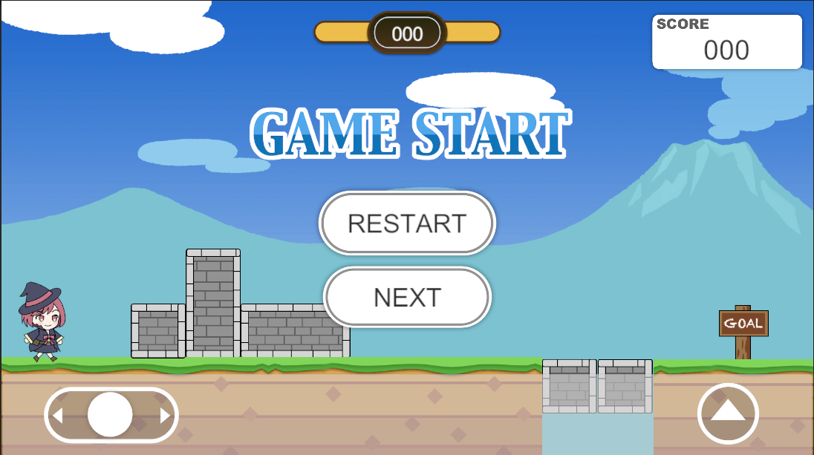
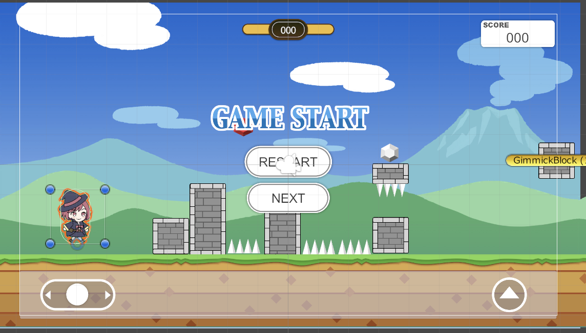
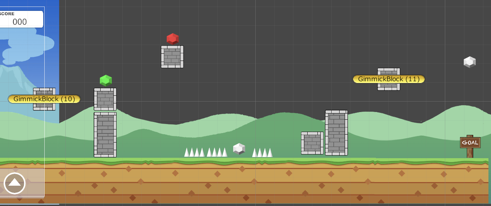
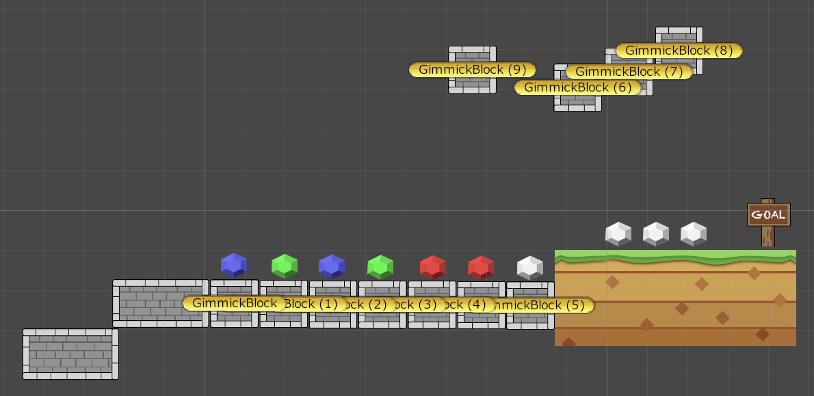
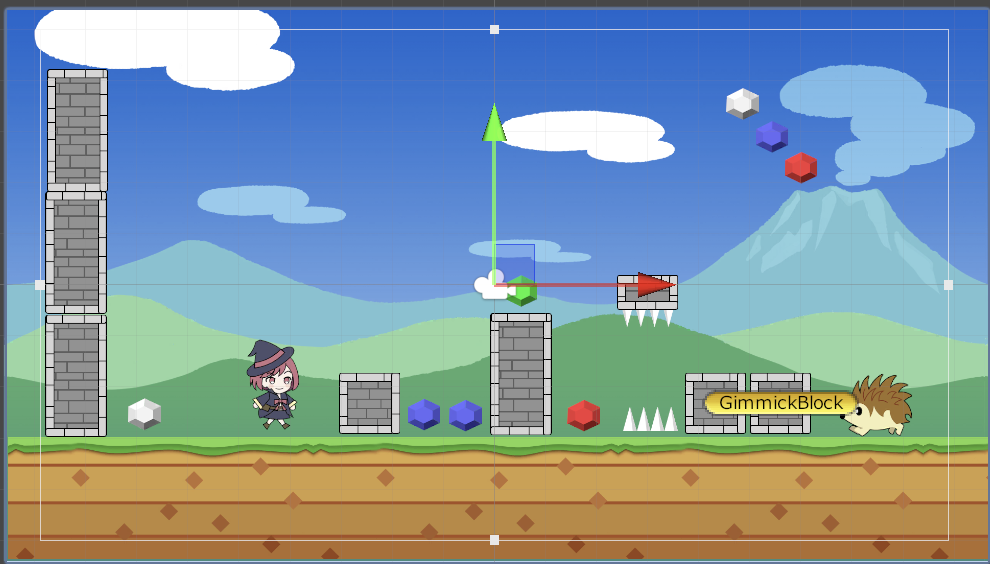
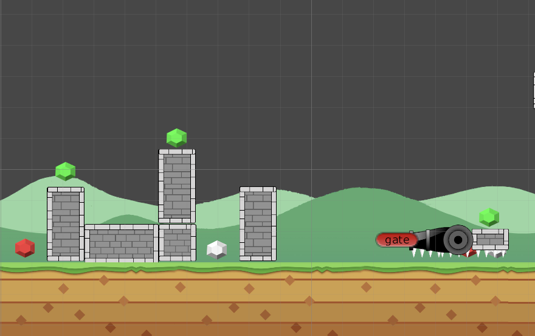
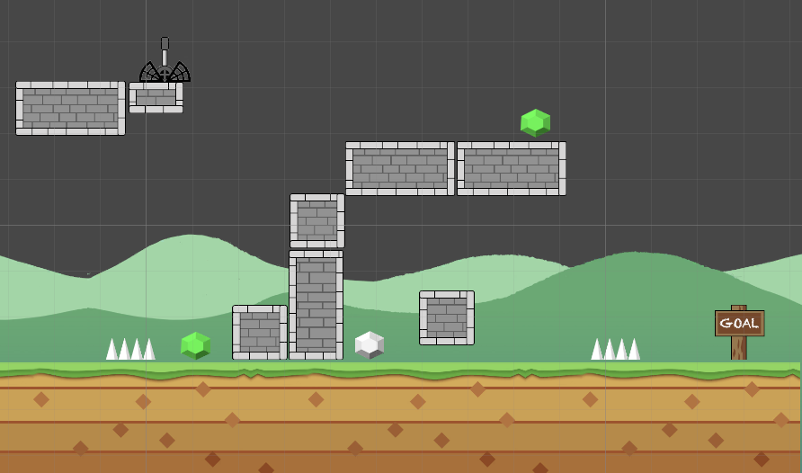

# Unity のゲーム規則について

## フォルダ作成基準

```Shell
Assets
	→UniSideGame_Assets：画像フォルダ
	→Projects
		→Scenes：シーンを保持するフォルダ
		→Scripts：スクリプトを保持するフォルダ
		→Prefabs：プレファブを保持するフォルダ
		→Materials：マテリアルを保持するフォルダ
		→Animation：アニメーションを保持するフォルダ

```

## Order in Layer

1. Character など最優先は 100 から 3 桁
2. 足場などのオブジェクトは 10 から 2 桁
3. 背景など，一番優先度低い 0
4. Canvas の優先度は，1000 から 4 桁
5. アイテムオブジェクトは，5
6. 多重背景は，1

## サイドビューゲームとは？？

サイドビューは，ゲームの世界を真横からのアングルで見たゲームシステムのこと．真横から見たアングルなので，移動は「右」と「左」の 2 方向になる．また，縦方向は高さを表すため「ジャンプ」というアクションが可能．移動が横だけなので判断がシンプルで比較的アクションゲームに向いているシステム．今回作成するのは，プレイヤーキャラを左右に動かし，画面左から右にあるゴールを目指すサイドビューの「ラン＆ジャンプ」ゲーム．

＜機能＞

- プレイヤーキャラ：左右とジャンプ
- 地面とブロックの上を歩ける
- ゴールとゲームオーバー時は UI で表示
- 開始とリスタートができる
- キャラクターに追従して横スクロールできる
- タイトル画面からゲームは開始される．
- 強制スクロールされるステージとされないステージが存在する
- 制限時間が存在して，その残りでもスコアが加算される．
- スコア制であるゲームである．
- スコアを獲得するアイテムが画面上に存在する
- 結果表示のリザルト画面に移動する．
- リザルト画面で結果を表示する
- ギミックがある
  - ダメージ床
  - ダメージブロック
  - 移動床（オブジェクトあたり判定で動く．動き続ける．）
  - 固定砲台 砲弾が定期時間でキャラが近くにきたら発射される
  - 動く敵．同じ場所を繰り返し動く
- ゲーム中のサウンドをつける
- スマホ対応のための UI を追加

## Scene 一覧

1. タイトルシーン(Title Scene) <br>
   ＜画像＞
    <br>
   <説明>
   ゲーム開始時に表示されるシーンです．ここからゲームを開始して，RUN ゲームに移動できる．
2. BaseStage <br>
   <画像>
    <br>
   <説明>
   Stage を作成するときのテンプレートページ．ここを複製して新規 Stage を作成していきます．
   通常の制限時間があるのみで，自分で移動したら画面が移動する．
3. BaseForcedScrollStage <br>
   <画像>
    <br>
   <説明>
   Stage を作成するときのテンプレートページ．ここを複製して新規 Stage を作成していきます．
   制限時間と強制スクロールがあり，左の壁に当たるとゲームオーバになるステージ．
4. Result 画面 <br>
   <画像>
    <br>
   <説明>
5. Stage1 <br>
   <画像>
    <br>
   <説明>
   ゲーム開始後に最初のステージなので，チュートリアル的に操作に慣れるようなステージにしています．スクロールせず最初の表示された画面でクリアできるようになっています．移動，ジャンプに慣れること，簡単にギミックとして落ちる床があり，落ちるとゲームオーバになることもわかる．「Goal」という木の部分にいくとクリアになることを理解できると思います．
6. Stage2 <br>
   <画像>
    <br>  <br>  <br>
   <説明>
   ステージ 2 つ目なので難易度を少し上げて，ギミックの追加を徐々にしていって，どんなことができるのかなどを確認してもらっています．ギミックでは，「移動床」「押せるブロック」「消えるブロック」「消えるブロック」「潰されるブロック」「ダメージ床」が追加されています．これで少しづつゲームに慣れていく．他にもスコアゲームであることもあり，ステージ 1 ではクリア時間だけですが，ステージ 2 からは宝石という色ごとに点数が異なるものでもスコアが追加されるようになっています．ゴールが二つあり，難易度が異なりスコアも多くとれたりするのでやり込み要素であり，スコアを取るには大切な方法でゲーム性を持たせています．
7. Stage3 <br>
   <画像>
    <br>  <br>  <br>
   <説明>
   ステージ 3 は，強制スクロールで進んでいくステージです．全てのアイテムを取らなければ普通にクリアができる難易度のステージになっているのかなと思います．
   強制スクロールのゲームなので，進む時にジャンプをしたり，うまく乗らないと時間がかかって壁に追いつかれてゲームオーバになってしまうというドキドキ感があるようなステージ構成を意識して作成しました．またギミックとして，「スイッチが必要な移動床」と「固定砲台」「移動する敵」を新規で追加しています．また，アイテムの配置が結構厳しいところに配置していたり，全てのアイテムがとれないものや，そのままアイテムを獲得するとゲームオーバになるような配置など一度目ではいいスコアを取りにくいステージ構成にしました．スイッチで動く床で乗ったままでいるとスコア宝石を取れるようになっています．ボーナス的なスコア獲得ができるというので面白さが追加されています．終わったと思ってそのまま降りるとゲームオーバになるところもいいところかなと感じています．
8. Stage4 <br>
   <画像>
    <br>  <br>  <br>
   <説明>

## 参考・参照・引用

1. [参考]()，2023 年 11 月
2. [参考]()，2023 年 11 月
